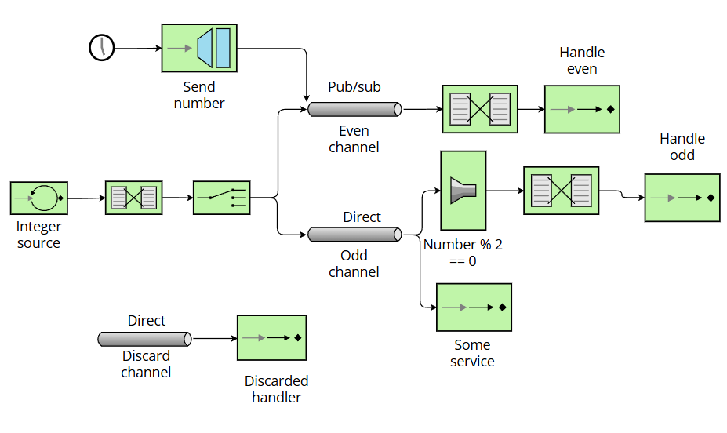

# Lab 5 Integration and SOA - Project Report

## 1. EIP Diagram (Before)



The started code had an integer generator which route the numbers in 
the even or odd channel depending on whether they were even or odd.

Then other number generator wrote every number in the even channel. 
This generator generates negative numbers.

The even flow read from the even channel which is pub/sub,
and processed the numbers in the channel.

The odd flow read from odd channel, due to this channel is direct the
messages were distributed among the odd flow and other service.
The odd flow filtered the numbers permitting only the even ones. 
The other service only processed the number printing it on screen.

The code had other channel named discard channel, but it was never used.

>PROBLEMS DETECTED
> 
> 1. The negative number generator wrote all its numbers in the even channel
>       even if the number was odd.
> 2. The odd channel was direct, so neither of the two services that read this
>       channel read all the messages.
> 3. The filter in the odd flow only permit the even numbers, so no odd number
>       would be processed.

---

## 2. What Was Wrong

Explain the bugs you found in the starter code:

- **Bug 1**: The problem was that the negative number generator wrote
        in the even channel all numbers. It happened because the "request channel"
        was evenChannel. The solution I provide consists in routing every message
        to a shared channel between the integer and the negative generator.
        Then the number flow will forward the messages to the even or odd channel.


- **Bug 2**: The odd channel was direct so the odd flow and the service never
      get every odd number. This happened because the odd channel
      was not declared in the code as pub/sub, so Spring Integration
      created the channel direct.
      My solution was to declare the channel as a pub/sub channel.


- **Bug 3**: The third bug was that the filter in the odd flow filtered
      all the odd numbers, so they could not be processed. This occurs because the 
      check condition was ```val passes = p % 2 == 0```. The problem is solved
      by changing the condition to ```val passes = p % 2 != 0```

---

## 3. What You Learned

Write a few sentences about:

- Enterprise Integration Patterns (EIP) are tested patterns that solve 
    problems while integrating systems. They are based on messages and channels to exchange 
    information, commands or events.
- Spring Integration permits to implement EIP in Spring. It is based on asynchronous messaging,
  this permits the components to "talk" by sending and receiving messages through channels.
- The main challenge in this laboratory was to understand how EIP works on spring, how
    the componentes exchange messages and how the flows work. To understand these things I
    read the guide carefully and I went to the lecture where the teacher explained
    the application flow and the different components.

---

## 4. AI Disclosure

I used ChatGPT to correct some parts of the report and my spelling mistakes.
In addition, I used Claude (sonnet 4.5) to fully understand EIP and Spring Integration.

---

## Additional Notes

The assignment is interesting, first is difficult to understand but when you read
the code and the guide you start to understand how EIP works and how can you use it.
And it is useful in the group project.
